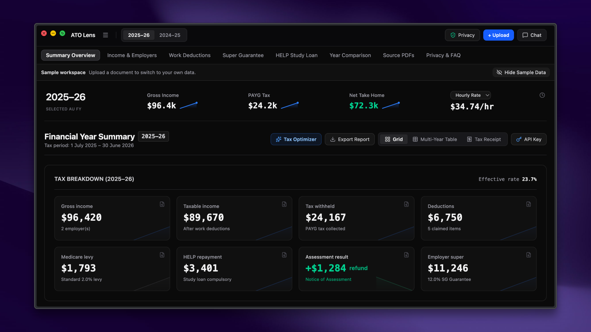

# ATO Lens

ATO Lens helps you visualise and understand your Australian tax history in a local-first workspace. Chat with your tax returns, income statements, and super contributions to find insights or catch mistakes.



## Download

Desktop builds are published on the [Releases page](https://github.com/realbakari/ATO-Lens/releases).

| Platform | File | Signed |
|---|---|---|
| macOS (Apple Silicon) | `ATO-Lens-<version>-arm64.dmg` | Signed with a Developer ID and notarized by Apple |
| macOS (Intel) | `ATO-Lens-<version>-x64.dmg` | Signed with a Developer ID and notarized by Apple |
| Windows | `ATO-Lens-<version>-x64.exe` | **Not signed** - see below |
| Linux | `ATO-Lens-<version>-x86_64.AppImage` | Not signed (normal for AppImage) |

**macOS** — open the DMG and drag ATO Lens to Applications. Because the app is notarized, it opens
with the standard "downloaded from the internet" prompt; no security override is needed.

**Windows** — ATO Lens has no Windows code signing certificate yet, so SmartScreen shows
"Windows protected your PC" with an unknown publisher. To install anyway, click **More info →
Run anyway**. If you would rather not bypass that warning, run the web app from source instead.

**Linux** — mark the AppImage executable and run it:

```bash
chmod +x ATO-Lens-*.AppImage && ./ATO-Lens-*.AppImage
```

### Updates

The desktop app checks GitHub for a newer release about eight seconds after launch, and offers to
download it if one exists. Nothing is downloaded without you agreeing, and updates install when you
quit. This request sends no tax data - it asks for a version number and nothing else. It is the only
network request ATO Lens makes on its own, and you can switch it off under
**Help → Check for Updates Automatically**, after which nothing is contacted unless you pick
**Check for Updates** yourself.

### Verifying your download

Every release includes `SHA256SUMS.txt`. This matters most on Windows, where nothing else vouches
for the installer:

```bash
sha256sum -c SHA256SUMS.txt --ignore-missing
```

On macOS use `shasum -a 256 <file>` and compare, and on Windows PowerShell use `Get-FileHash <file>`.

## Get Started

### 1. Install dependencies

```bash
git clone https://github.com/realbakari/ATO-Lens.git
cd ATO-Lens
npm install
```

### 2. Run the web app

```bash
npm run dev
```

Open [localhost:5173](http://localhost:5173) in your browser.

### 3. Or run the desktop app

```bash
npm run electron:dev
```

## How It Works

1. **Upload** your tax return, Notice of Assessment, income statement, payslip, super, or HELP statement PDFs
2. **Review** parsed income, deductions, super guarantee compliance, and HELP repayments
3. **Chat** with the built-in assistant to understand your tax situation

ATO Lens works fully offline with a built-in rule-based parser. Optionally add your own Anthropic, OpenAI, or Gemini API key in API Key Setup for AI-assisted PDF extraction and chat reasoning.

## Privacy & Security

### How Your Data is Processed

Your tax data is processed locally in your browser (or the desktop app) and the workspace is stored in local storage. There is no ATO Lens account, server, cloud database, telemetry, or analytics service.

The default rule-based parser and OCR stay on your device. If you deliberately choose Claude, OpenAI, or Gemini document parsing, the original selected PDF is sent directly from your device to that provider using your key. AI chat sends a redacted copy of the system context, prior turns, and current message to the selected provider. Ollama uses the local or self-hosted endpoint you configure. None of these requests passes through an ATO Lens intermediary.

### Verify It Yourself

ATO Lens is open source. You can review the code yourself, or ask an AI to audit it for you. Copy the prompt below and paste it into Claude, ChatGPT, or any other AI assistant:

<details>
<summary>Copy security audit prompt</summary>

```
I want you to perform a security and privacy audit of ATO Lens, an open source Australian tax workspace.

Repository: https://github.com/realbakari/ATO-Lens

Please analyze the source code and report what it actually does:

1. DATA HANDLING
   - Tax documents are parsed locally by default (src/parser/ruleBasedParser.ts)
   - Trace optional document uploads and redacted chat requests
     (src/parser/claudeParser.ts, openaiParser.ts, geminiParser.ts,
     src/lib/aiChatClient.ts)
   - Identify exactly what is stored locally (src/storage/db.ts)

2. NETWORK ACTIVITY
   - Identify all network requests in the codebase
   - Inspect GitHub updater and configured AI-provider calls
   - Check for any hidden data collection, font requests, or tracking

3. API KEY SECURITY
   - Inspect how API keys are stored and sent (src/lib/apiKeys.ts)
   - Check that keys are not logged or exposed

4. REDACTION
   - Test chat system context, prior turns, current messages, and activity descriptions
   - Confirm original PDF uploads are disclosed as raw (src/storage/privacyLog.ts)

5. CODE INTEGRITY
   - Look for obfuscated or suspicious code
   - Review dependencies for anything concerning

Report privacy/security concerns and uncertainty; do not assume these claims are correct.
```

</details>

## Releasing

Pushing a `v*` tag runs [the release workflow](.github/workflows/electron-release.yml): it builds
macOS (arm64 + x64), Windows and Linux, attaches `SHA256SUMS.txt`, and opens a **draft** GitHub
Release to publish manually.

macOS signing and notarization need these repository secrets. Without `MAC_CSC_LINK` the workflow
still succeeds, but emits an unsigned macOS build and logs a warning:

| Secret | What it is |
|---|---|
| `MAC_CSC_LINK` | Developer ID Application certificate as a base64 `.p12` (`base64 -i cert.p12 \| pbcopy`) |
| `MAC_CSC_KEY_PASSWORD` | Password protecting that `.p12` |
| `APPLE_ID` | Apple ID email for notarization |
| `APPLE_APP_SPECIFIC_PASSWORD` | App-specific password from appleid.apple.com (not the account password) |
| `APPLE_TEAM_ID` | 10-character team ID from the Apple Developer portal |

The macOS job verifies its own output with `codesign --verify` and `spctl --assess` before
uploading, so a signing or stapling failure fails the build instead of shipping an app that
Gatekeeper will reject.

Windows installers are unsigned until a certificate is purchased. Since 2023, OV certificates
require hardware or HSM storage, so the practical options are a cloud signing service (Azure
Trusted Signing, SSL.com eSigner, DigiCert KeyLocker) or an EV certificate. Once available, add the
`.p12` as `WIN_CSC_LINK` / `WIN_CSC_KEY_PASSWORD` and pass them to the Windows packaging step.

## Requirements

- Node.js 20 or later
- Your own Australian tax documents
- (Optional) An API key from [Anthropic](https://console.anthropic.com/settings/keys), [OpenAI](https://platform.openai.com/api-keys), or [Google AI Studio](https://aistudio.google.com/apikey)

## Tech Stack

React 19, TypeScript, Tailwind CSS v4, Recharts, Electron.

## License

AGPL-3.0
